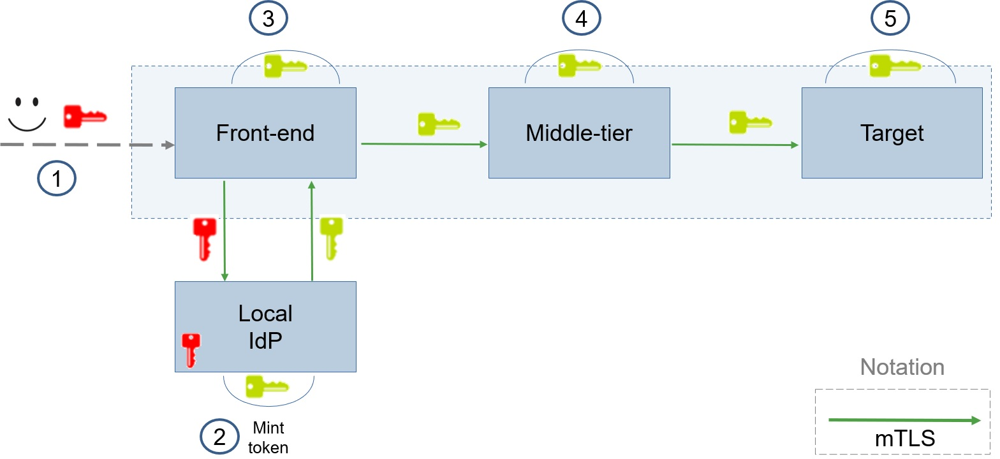

# HPE/USP Transitive Identity & Embedded Claims

This repository is part of **HPE/USP Transitive Identity & Embedded Claims** project. Experimental components are proposed and assessed by means of a bank application, where the user can deposit "money" and check their balance. These requests are then passed along several workloads. Each phase creates a new security token, providing new type of algorithms and functions.

> ## Basic Scenario
> 
>
> - Front-end or sometimes **Subject Workload** conveys an assertion made by a
SPIFFE-identified workload.
> - Local IdP or **Asserting Workload** is the core of the implementation. It transforms an Oauth Token (**Red Key**) into a new security token (**Yellow Key**), eventually navigating through multiple workloads.
> - Middle-Tier represents any number of workloads that the security token will go through before reaching the Target Workload.
> - Target workload represents the last jump of the security token before handling the data back through the Front-End.

# Phase 1
This stage involves in to specify and develop a new security document defined as **Delegated Assertion SVID** or **DVID**, as a JWT token derived from an OAuth token. This security document is sent to other workloads instead of the OAuth to avoid impersonation problems. The **main objective** is to grant and validate if the calling workload have the sufficient rights to access the desired resource.

>For the complete **DVID** specification, check [**here**](https://docs.google.com/document/d/1fH8XkOKGXGrWy9uk-JXZbyksHejZ2CfB7h6YXetqG_w).
>
>Check [**here**](https://github.com/HPE-USP-SPIRE/signed-assertions/tree/main/samples/SVID-NG) for a code sample.


## Phase 2

In this phase, the objective is to develop a new token scheme named **Nested Token** allowing to easily append new claims to an existing token. Essentially, the goal of such a token format is to allow pieces of information (i.e., claims) to be appended to an existing token efficiently and securely, giving support to different use case scenarios (e.g., permission delegation, tracing the path taken by a request since its origin, among others). There are two versions of this nested token:

- **ID Mode**: The workloads uses SPIRE SVID private keys to sign the tokens. The user OAuth token is exchanged for an ECDSA assertion, provided by the Identity Provider (IdP). Each workload in the application adds new issuer claim with its own public key and audience with the public key of the next hop, and its own signature. Alongside the token, the workload forward also its trust bundle, allowing for offline identification and validation.
- **Anonymous Mode**: The workloads don't use any IdP. This model do not offer identification of the workloads, but takes advantage of this by using a signature concatenation model that allows for token size reduction and fast validation execution times. The resulting token is smaller than in ID-mode, as it removes part of the signatures to use as private key. Also, there is no need to send certificates along with the token.


> For the complete **Nested Token** specification, check [**here**](https://docs.google.com/document/d/1nQYV4wf8wiogpxboIVbwtFZyZjLNRejyguHoGZIZLQM).
>
> Check [**here**](https://github.com/HPE-USP-SPIRE/signed-assertions/tree/main/samples/IDMode) for a code sample related to the **ID-Mode**.
> Check [**here**](https://github.com/HPE-USP-SPIRE/signed-assertions/tree/main/samples/anonymousMode) for samples related to the **Anonymous Mode**.


## Phase 3

This phase proposes using the nested token model (phase 2) to develop a new identity document type called a **Lightweight SVID** (LSVID). When created, this document can be extended with additional relevant information (assertions) and used as a token in multiple distributed use case scenarios, including attestation, authorization delegation, and path tracing.

> For more information, check the [design document](https://docs.google.com/document/d/15rfAkzNTQa1ycs-fn9hyIYV5HbznPBsxB-f0vxhNJ24) and the [code specification](https://github.com/HPE-USP-SPIRE/signed-assertions/tree/main/samples/phase3).

## Setting up the environment

### Dependencies

#### Installation
Some packages are required to run the proof of concept. Execute the script below to install them:

```
./scripts/install_dependencies
```
To uninstall the modified SPIRE, run the command with the flag **-u**:

```
./scripts/install_dependencies -u
```

This project was developed on Debian 11 with Docker v20.10.11 and Go v1.16.9 or newer.

### Configuration

This code uses OAuth tokens provided by OKTA (an identity provider). This section explores how to set up the OKTA application environment.

>Fetch your private private IP with ```ip a``` or similar. Take note of it because this will be used to configure the application.
>
>After that, [register](https://developer.okta.com/signup/) to their platform, creating a **developer account**.
>
>When logged in:
>
>1. Go to Applications -> Application in the menu
>2. Click on "Create App Integration"
>3. Choose "OIDC" as the sign-in method and "Web Application" as the application type
>4. Under "Client acting on behalf of a user", check "Authorization Code" and "Implicit (hybrid)". Let the wildcards checkbox disabled.
>5. Under "Sign-in redirect URIs", remove whatever is in there and add: http://IP:8080/callback, where IP must be your private IP
>6. Under "Controlled Access", check "Allow everyone in your organization to access"
>
>After that, execute ```./scripts/generate_cfg_template.sh``` to generate a configuration file in the root path. Alter the variables to match your data:
>
>- CLIENT_ID and CLIENT_SECRET: credentials provided by OKTA
>- ISSUER: developer number ID that can be found after login
>
>- HOST_IP and WORKLOAD_IP: substitute both variables in the `.cfg` for you IP (which must also be set under "Sign-in redirect URIs" in your OKTA application)

### Running the project in a VM

To be able to correctly run the project using a Virtual Machine, it must be configured to bridged mode. This setting is usually found under the Network Settings.

## Running the application

To execute the application, run:

```
./init
```

sudo may be necessary to run it. 

You will be asked which model (phase) you want to use.

After prompted that the execution finished successfully, open your browser on localhost:8080.

**Important**: Always check if your IP is correctly set in OKTA and in `.cfg`

## Repository's structure

The repository is organized as follows:

- **samples**: contains the code for each phase the respective documentation.
- **poclib**: prototype of a Go package, containing the nested tokens' functions.
- **assertgen**: command-line interface (CLI) to perform different functions, like interacting with the Identity Provider and executing all poclib functions.
- **scripts** auxiliary bash scripts
- **doc**: contains images related to the README files for documentation

# License

This project is licensed under the terms of the Apache 2.0 license. It was developed to support the HPE/USP Transitive Identity & Embedded Claims project. It is not intended to be executed in a production environment without the required security and performance evaluations.
